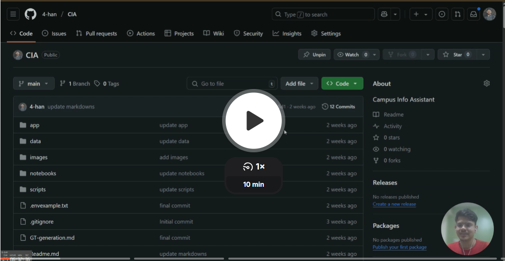
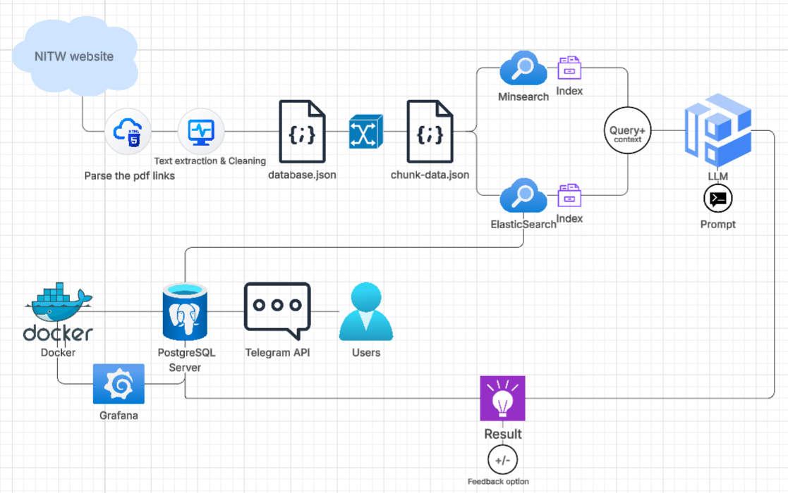

## Campus Info Assistant (CIA) for NITW
## Project Overview

This project develops a Telegram chatbot designed to act as a **RAG (Retrieval-Augmented Generation)** assistant, providing information about the National Institute of Technology Warangal (NITW). The bot retrieves information from the [official website](https://nitw.ac.in) and uses a **Large Language Model (LLM)** to generate informative and context-aware responses, helping students navigate the college environment more efficiently even with ambigious queries that other llms couldn't understand.

## Video Walkthrough
<a href="https://www.loom.com/share/a79d9d258d544f5d92a00385f06d37fc">
  
</a>


## Project Structure


## Problem Statement

While the National Institute of Technology Warangal (NITW) publishes a large amount of important information on its official website, keeping track of all the updates, rules, and guidelines can be a hard task—especially for new students. Personally speaking when I first started representing my class in the 3rd year, I realized how overwhelming it was to constantly monitor and share important information with my peers.

For freshmen, the sheer amount of guidelines, rules, regulations, and administrative updates on the website can be difficult to navigate. Furthermore, there is a lack of a dedicated system that can respond to questions and help students quickly find the answers they need.

As a result, I saw a clear need for an AI assistant that could:

- **Retrieve and summarize** key information about college policies, deadlines, and events.
- Help **freshers and current students** easily understand the norms and rules of the college.
- Act as a **personal assistant** to keep students updated with the latest announcements.
- Provide **answers to FAQs** and guide students in a way that is easy to understand, saving them from feeling overwhelmed by information overload.

By creating an AI-powered chatbot, I wanted to provide a simple, engaging solution that would allow students to interact with the college’s data in a more user-friendly and accessible manner. This would ultimately help them adjust faster and more confidently to college life.


### Key Features:

- **Conversational Interface**: Interact with the bot directly through Telegram, ensuring ease of use and quick access for users.

- **RAG Pipeline**: Combines document retrieval with LLM capabilities for enhanced answer generation based on the provided context, ensuring responses are relevant and informative.

- **Data Indexing**: Utilizes a local search index [Minsearch](./app/minsearch.py) built from NITW-specific documents, making the bot efficient in searching and retrieving information quickly.

- **LLM Integration**: Leverages a Large Language Model for generating human-like responses, providing users with more engaging and natural interactions.

- **Source Citation**: Provides links to the source documents used to generate answers, ensuring transparency and trust in the responses.

- **Interaction Logging**: Stores user queries, bot responses, and interaction metadata in a PostgreSQL database, allowing for tracking of bot performance and identifying areas for improvement.

- **Search Engine Evaluation**: Evaluates and decides between semantic (vector) search or lexical (text) search based on the context and tunes the parameters accordingly. This choice ensures that the search method is optimized for accuracy and performance, providing the best possible response.

- **RAG Evaluation (AI Judge)**: Uses LLM as a Judge too choose among the choices- `RELEVANT`, `NON-RELEVANT`, or `PARTIALLY RELEVANT` plus ROUGE-based evaluation. This unique evaluation method helps in self-assessing the relevance of the bot's answers and improves its overall performance over time.

- **User Feedback**: Allows users to provide "Thumbs Up" or "Thumbs Down" feedback on bot responses via inline keyboard buttons. This feature helps to improve the bot’s accuracy over time by learning from user feedback.

- **Monitoring Dashboard**: Includes a Grafana instance pre-configured to visualize bot activity and feedback metrics from the PostgreSQL database, enabling easy monitoring and optimization of the system's performance.

- **Containerized Deployment**: Uses Docker and Docker Compose to package and manage the bot, database, and monitoring services in isolated containers, ensuring better scalability, reproducibility, and easier management of the entire system.


## Scope of Capabilities:
### Data Source and Web Scraping

The chatbot is designed to answer questions based on the information present in the provided data source ([database.json](./data/database.json)). This includes general information about NIT Warangal that was web scraped using Python libraries namely `selenium`, `PyMuPDF`, and `beautifulsoup`. The data potentially covers various topics, such as institue notification, workshop updates and notices.
The quality and scope of answers are directly tied to the content and structure of the `database.json` file. However, as observed, some of the information that `PyMuPDF` could parse only includes text inside the PDFs, and unfortunately, it couldn’t extract image-based texts as it lacks OCR (Optical Character Recognition) capabilities.

This means that while most of the text-based information is successfully retrieved, some image-based content or poorly formatted PDFs may not be included in the data source. As a result, users may find that certain information might be missing or incomplete.

## Project Components

## Key Technologies

| **Technology**                 | **Description**                                                                                              | **Why It Matters**                                                                                                   |
|---------------------------------|--------------------------------------------------------------------------------------------------------------|----------------------------------------------------------------------------------------------------------------------|
| **Telegram Bot API (`python-telegram-bot`)** | Handles communication with Telegram users.                                                                  | It was the only free and easy-to-use API for handling user interactions unlike whatsapp.                                 |
| **Configuration Management (`python-dotenv`)** | Loads sensitive information (API keys, database credentials) from a `.env` file.                            | Helps in securely managing API keys and model changes, keeping sensitive data safe and easily configurable.           |
| **Data Storage (`PostgreSQL`)** | A relational database to log bot interactions, user feedback, and associated metadata.                        | Essential for tracking user interactions and enabling detailed monitoring and insights through Grafana.               |
| **Search Index (`Minsearch`)**  | A lightweight, in-memory search engine for retrieving document chunks based on queries.                       | Offers a less computationally expensive solution for efficient text-based search, optimizing performance.            |
| **SDK (`genai` and `openai`)**  | APIs for interacting with advanced language models like Google Gemini and OpenAI.                             | Extra rate limits and access to powerful language models for enhanced performance and flexibility.                    |
| **Monitoring (`Grafana`)**      | A visualization tool for creating dashboards to monitor bot usage, feedback, and database activity.           | Provides real-time insights into bot performance, user activity, and feedback, ensuring continuous optimization.      |
| **Containerization (`Docker`, `Docker Compose`)** | Packages the bot, database, and Grafana into isolated containers and manages their interactions.              | Improves scalability, reproducibility, and simplifies deployment and maintenance of the entire system.                |

## Getting Started

### Prerequisites
-   Miniconda environment installed. [`Guide`](https://docs.conda.io/projects/conda/en/stable/user-guide/install/linux.html)
-   Docker and Docker Compose installed on your system.
-   A Telegram Bot Token obtained from [@BotFather](https://t.me/BotFather) on Telegram.[`Guide`](https://youtu.be/vZtm1wuA2yc?si=EYsUeURzZFhABWTD)
-   An OpenAI API key which can be obtained by signing on [OpenAI](https://platform.openai.com/api-keys) or [OpenRouter](https://openrouter.ai/settings/keys) (Free)
-   A Google Cloud Project and a valid Google API Key with access to the Gemini models (optional).

### Setup

1.  **Clone the repository:** 
    ```bash
    cd your_repository_directory # eg: ~/CIA
    git clone https://github.com/4-han/CIA.git
    ```

2.  **Create and Configure the `.env` file:**
    *   Navigate to the project's root directory (`CIA/`).
    *   Create a file named `.env` (can take reference from `.env-example`).
    *   Copy the following content into `.env` and replace the placeholder values with your actual credentials and desired settings:


### Running the Application with Docker Compose

1.  **Navigate to the project's root directory (`CIA/`)** in your terminal.

2.  **Build and start the Docker containers:**
    ```bash
    docker-compose up --build -d
    ```
    or
     ```bash
    docker-compose up  -d
    ```
    *   `--build`: Builds the Docker images (especially the bot image) before starting. Use this the first time, or after changing code, `requirements.txt`, or `Dockerfile`.
    *   `-d`: Runs the containers in detached mode (in the background).

3.  **Verify containers are running:**
    ```bash
    docker-compose ps
    ```
    You should see `rag_postgres_db`, `rag_telegram_bot`, and `rag_grafana` with status `Up`.

4.  **Check logs for troubleshooting:**
    ```bash
    docker-compose logs bot
    docker-compose logs db
    docker-compose logs grafana
    ```
    These commands are essential for diagnosing startup issues.

5.  **To stop the application:**
    ```bash
    docker-compose down
    ```
    To stop and remove containers, networks, and volumes (for a clean start, **caution: this will delete your database data**):
    ```bash
    docker-compose down --volumes
    ```

## Using the Bot

Once the `rag_telegram_bot` container is `Up`:

1.  Open the Telegram app.
2.  Search for your bot's username (@your\_bot\_username).
3.  Start a chat and send `/start`.
4.  Ask questions about NIT Warangal based on your data source.
5.  Give the Feeback.


## Monitoring with Grafana

Once the `rag_grafana` container is `Up` and you have configured the PostgreSQL data source:

1.  Open your web browser and go to `http://localhost:3000`.
2.  Log in with your Grafana admin credentials (`GRAFANA_ADMIN_USER` / `GRAFANA_ADMIN_PASSWORD` from `.env`, or default `admin`/`admin` if not set).
3.  Create new dashboards and panels. Use your PostgreSQL data source to query the `rag_interactions` table. Example queries are provided in the steps of this project's development history or can be explored using `pgcli`/`psql`.


## Development History (Brief Summary)

This project was built iteratively, starting with core RAG logic and gradually integrating components:

1.  Initial RAG script and data loading.
2.  Setting up PostgreSQL with Docker Compose.
3.  Building the Telegram bot structure (`python-telegram-bot`).
4.  Integrating RAG into the bot application (`rag_service.py`, `main.py`).
5.  Containerizing the bot with Docker and Docker Compose.
6.  Integrating database logging for interactions and feedback.
7.  Adding feedback buttons in Telegram.
8.  Integrating Grafana for database monitoring and visualization.


### database checking

```bash
pgcli -h localhost -p 5432 -U rag_user -d rag_db ```

-h localhost: Specifies the host is your local machine.
-p 5432: Specifies the port mapped from the container to your host.
-U rag_user: Specifies the database user (replace rag_user with your DB_USER).
-d rag_db: Specifies the database name (replace rag_db with your DB_NAME).
```

* For Information about ingestion pipeline refer [ingestion](ingestion.md) and [text-extraction](text-extract.md)
* For Ground Truth Evaluation refer [Ground Truth](GT-generation.md) or [notebook](./notebooks/ground_truth.ipynb)
* For Retreval evaluation refer  [EVAL](./notebooks/evaluation_retrival.ipynb) or  [Retrival](retreval.md)
* for RAG evaluation refer [RAG](./notebooks/RAG-eval.ipynb)

## Future Enhancements

*   Expand the data source with more comprehensive information about NIT Warangal.
*   Implement more sophisticated data parsing and chunking.
*   Explore vector embeddings and vector databases for improved retrieval.
*   Add more advanced prompt engineering techniques.
*   Implement more robust error handling and logging.
*   Explore different LLM providers or models.
*   Deploy to a cloud platform for public access.
*   Add more advanced monitoring metrics and Grafana dashboards.